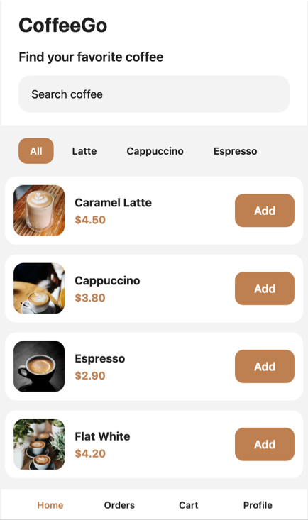
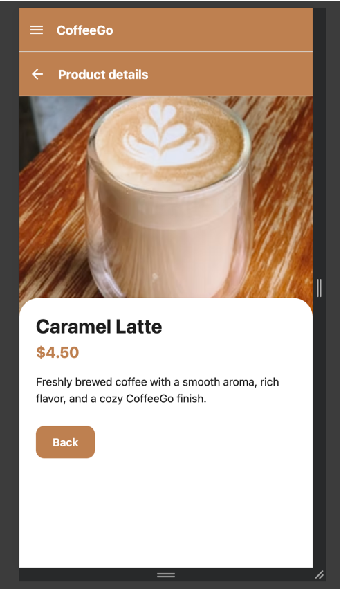
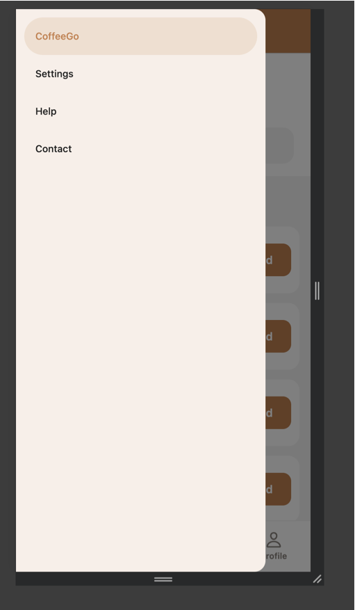

# CoffeeGo

CoffeeGo is a React Native Expo homework project for practicing React Navigation in a coffee ordering app. The app uses plain React Navigation with stack, bottom tab, and drawer navigators.

## Navigation Structure

- Drawer Navigator: wraps the app and provides access to CoffeeGo, Settings, Help, and Contact.
- Stack Navigator: handles drill-down navigation from the main tabs to Product Details.
- Bottom Tab Navigator: provides the main app sections in this order: Home, Orders, Cart, Profile.

## Screens

- Home
- Product Details
- Cart
- Orders
- Profile
- Settings
- Help
- Contact

## Route Params Example

When a product card is pressed on Home, the app opens Product Details and passes product data:

```js
navigation.navigate(SCREENS.PRODUCT_DETAILS, {
  id: coffee.id,
  title: coffee.title,
  price: coffee.price,
  imageUrl: coffee.imageUrl,
});
```

`ProductDetailsScreen` reads this data from `route.params` and shows a safe fallback if the params are missing.

## Adaptive Design Notes

The Home screen uses a centered app shell with a maximum width of 430px for web while staying full width on mobile. Product cards calculate their width with `useWindowDimensions`, keeping the layout readable on small screens and controlled on wider screens.

## Run Instructions

```bash
npm install
npm run web
```

For native Expo Go testing:

```bash
npm start
```

## Screenshots

### Home Screen


### Product Details Screen


### Drawer Navigation

